#  My Cocktail App
**Project:** T3A2-A Full Stack App (Part A)

**Brief:** Design a web application (app) that solves a real life problem.

**Group Members:**

* Marion Akinyi
* Katrina Tomaszczyk

**Important Links:**

[Trello](https://trello.com/invite/b/bGaDJxU8/ATTI8ede4dc9eb69ccd7f3c83fc1213fe4b54F7075F6/t3a2-mern-app-part-a) - Product Delivery (Board is Public)

[Miro](https://miro.com/app/board/uXjVPzbXD88=/) - Virtual Whiteboard for Team Collaboration (Anyone with link can view)
________________________________________________________________

## Table of Contents

[My Cocktail App](#mycocktail)
1. [Introduction](#introduction)
2. [Dataflow Diagram](#dataflow)
3. [Application Architecture Diagram](#architecture)
4. [Minimal Viable Product](#mvp)
5. [User Stories](#userstories)
6. [Wireframes](#wireframes)
7. [Product Tracking - Trello](#trello)

[Product Development](#productdevelopment)
1. [Ways of Working](#working)
2. [Brainstorming](#brainstorming)
3. [Defining the problem](#problem)
4. [User Story Mapping](#storymapping)
5. [Analysis](#analysis)
6. [Design Concepts](#design)

[Technical Documentation](#techdocumentation)
1. [Cocktail API](#api)
2. [Technical Discovery](#techdisco)

# My Cocktail App

# Introduction
The purpose of **My Cocktail App** is to develop a Wiki app guide to making classic and modern cocktails. Using the  cocktail database API. It features a database with  lists  of ingredients for each cocktail recipe, allowing users to quickly find the ingredients they need to craft a particular drink, by filtering using alcohol type and name of cocktail.

**Target Audience:**

This app is targeted to  home bartenders, cocktail enthusiasts and professional bartenders.

**Customer-facing Frontend:**

- A search bar designed to help users quickly find cocktails and recipes by name or ingredient or even by type of spirit.
- Display list of cocktails
- A “favourites” section where users can save their favourite recipes for easy access later.
- Display ingredients and detailed  recipes  of cocktails

**The API Backend:**

- Users (login/register)
- Authentication to delete/ view  saved recipes
- View My Saved Cocktails

**Tech Stack:**

* Mongo / Mongoose
* Express JS
* React 
* Node JS

# Dataflow Diagram

**Dataflow Design**

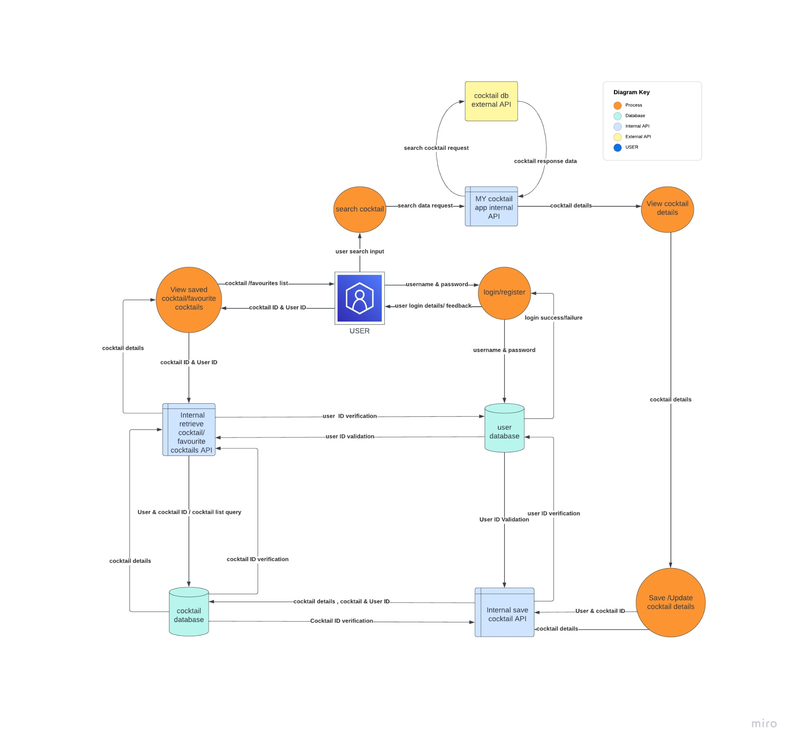

# Application Architecture Diagram

**MERN Stack App - Architecture Diagram**

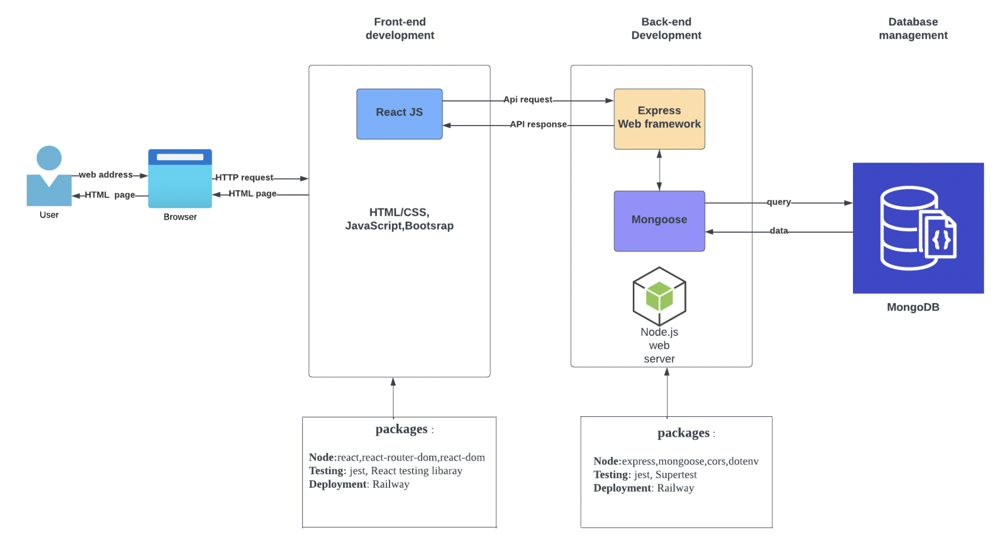

**High Level System Context Diagram**

The below diagram is a high level view of the My Cocktail App. With this high level view, it can be easily identified that there is a lot more complexity, without the additional detail. The additional detail in regards to componments, and interactions between components is in the Dataflow Diagram. This diagram would be used to discuss with Product Managers and Stakeholders.

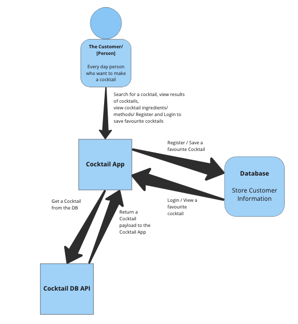

# Minimal Viable Product

A minimum viable product, or MVP, is a product with enough features to attract early-adopter customers and validate a product idea early in the product development cycle.

**MVP API Features:**
* Home Page / Search Feature
* Users can do a search by alcohol,name,ingredients.
* Users can view cocktails / information
* Users can view a list of cocktails for ideas

**The API Backend:**

CRUD routes for cocktails to: 
* Get list of random cocktail from cocktail db API
* Get  cocktails by name from cocktail db API
* Get cocktail ingredients and recipes from cocktail db  API
* Get cocktail by alcohol type from cocktail db Api

Extra & Additional Features: To have a better experience

Frontend

* Register & Login
* users can save their favorite cocktails
* users can view their favorite cocktails
* Filter on search results - Ability to search with ingredients that you have. Then match a cocktail to those ingredients.

Backend

Users:

 (login/register)

* Authentication to delete/ view saved recipes
* Save favorite cocktail
* View My Saved Cocktails
* Update favorite cocktail list

# User Stories

User Stories capturing the MVP Features

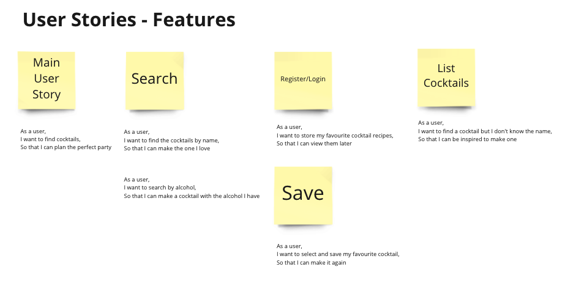

# Wireframes

Wireframe Design Notes:
* Desktop Appplication wireframes
* Mobile Web Application wireframes
* Responsive Design
* User Flow Diagram

## Desktop Application Wireframes

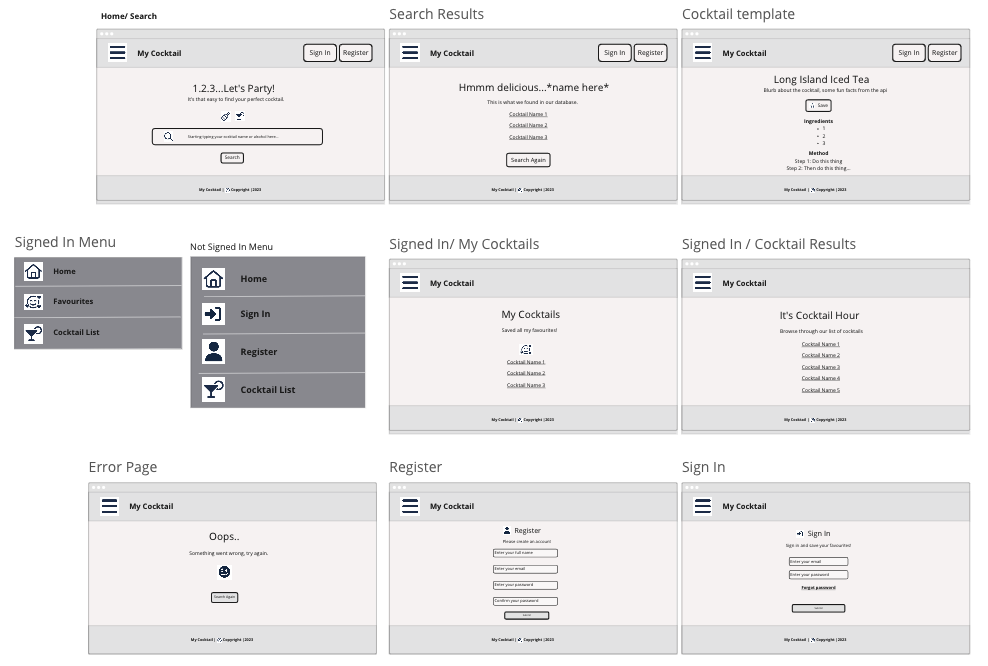

## Mobile Web Application Wireframes

**Not Signed In Flow**

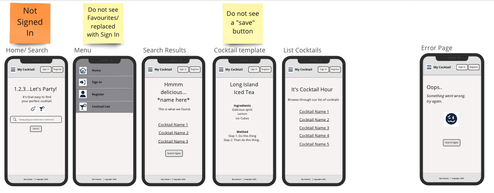

**Register Flow**

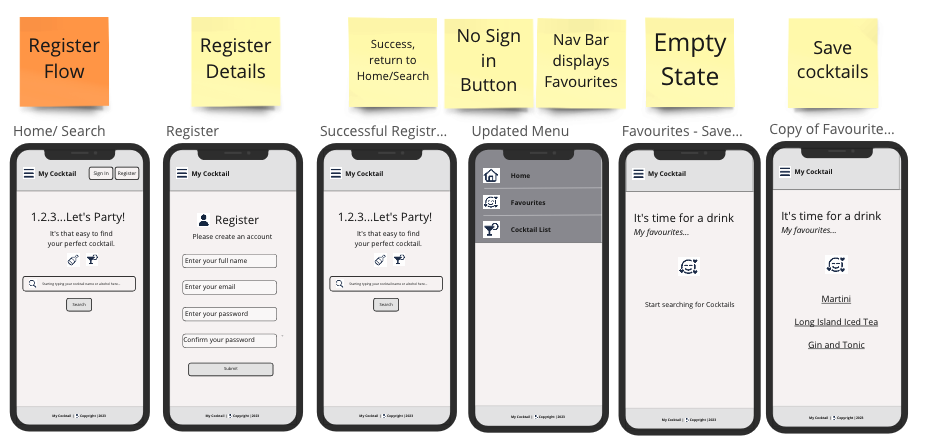

**Sign In Flow**

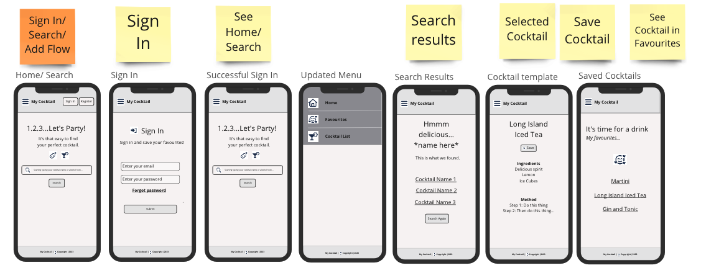

## User Flow Diagram

**Without Login**

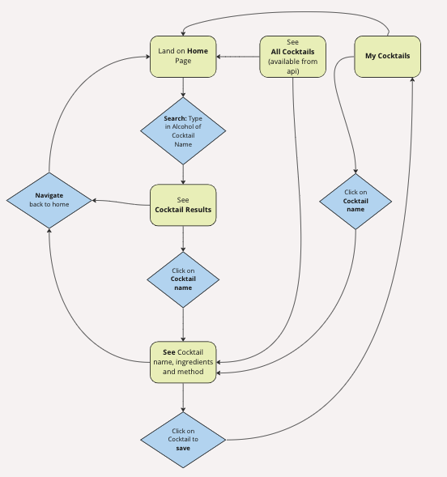

**With Login/Register**

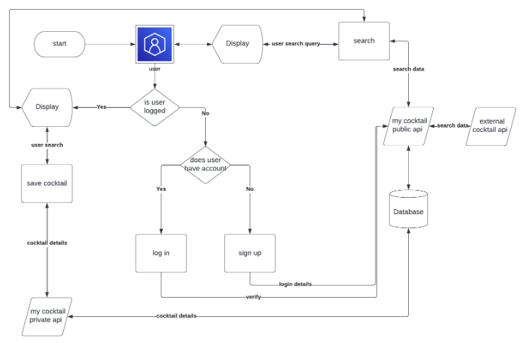

# Product Tracking - Trello

**Day 1: Trello Screenshot**

**Notes:**
* Official day of starting My Cocktail App as a Team. 
* Previously set up ways of working with Team expectations
* Monday the 16th of Jan - Review and update wireframe concept
* Tech investigation of API/ Architectural design investigation of Tech Stack

In the above screenshot, together as a Team we brainstormed and decided on the purpose/ features/ components/ target audience and tech stack. 

**In Progress: Trello sreenshot**

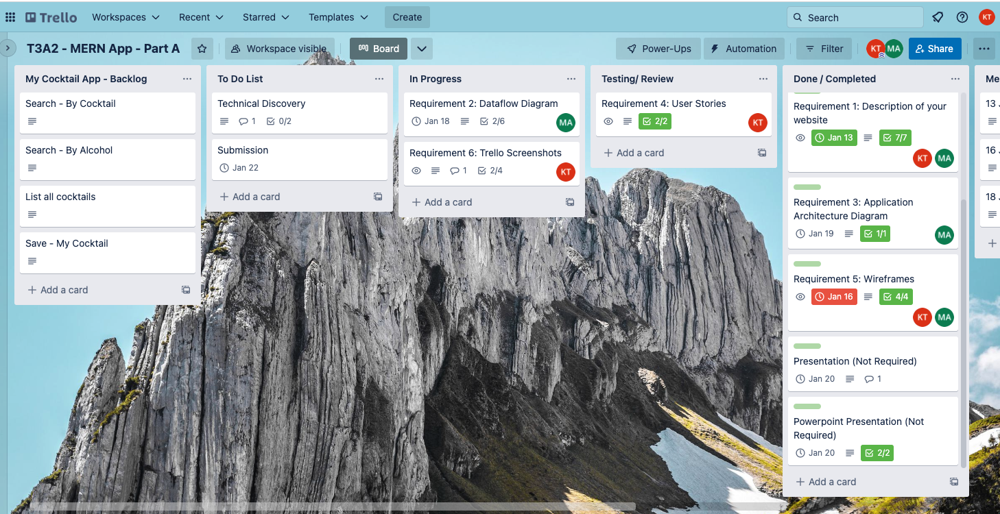

**Notes:**
* Finished Architecture Aiagram
* Wireframes completed - however low-fi is next (decisions on font family/ colours/ update to design / styling)
* User Stories added to Backlog of My Cocktail App - In preperaton for Development.
* No need for a presentation (powerpoint) or video presentation.
* Setting up a Tech Discovery to break out the components and tasks in preperation for development. 

**In Progress: After Technical Discovery**

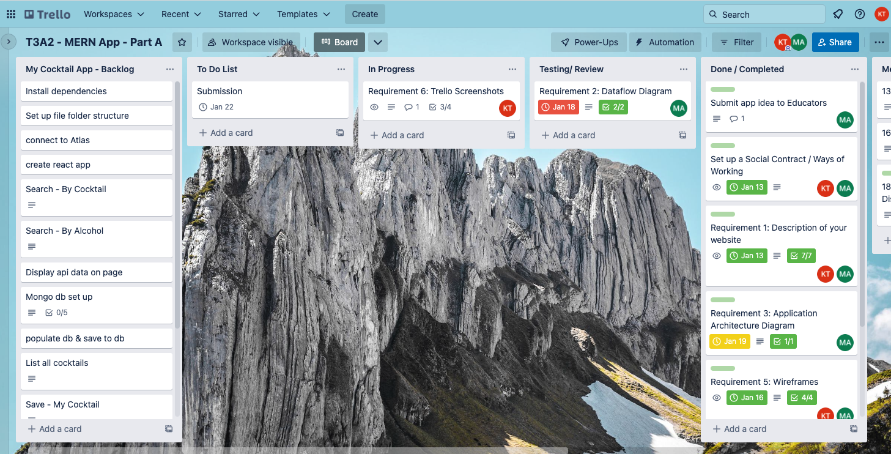

**Notes:**
After the Technical Disovery, we have a better indiciation of the complexity and where to start. 

* To Do list - Set up environment, deployment, MVC folders for Backened and Frontend. 
* Create a Git Repositoy
* Set up Mongo Database
* Set up a Frontend 
* Start with building the framework for Home/Search (Frontend/Backend)

This is an interative process and we can continue to do this style of meeting to discovery any complexity. 

**Ready for Submission:**

Trello snapshot of all tasks completed for PART A. Ready for Development with our Backlog updated (with what we know so far).

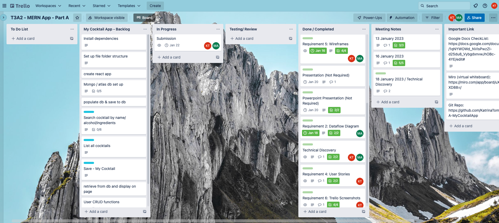

With a seperate MVP Column to track Feature competition. Added additional requirements for Phase B to track.

# Product Development

Below are the steps as a Team we took to help us understand the following:

* How to effectively work as a Team
* Product Delivery methodologies
* Understand the problem we are solving 
* Product analysis methods
* Identify target audience for this application
* Tech investigations to make sure we are using the correct tech stack / components

# Ways of Working

Ways of working is how a team collaborates. It should lead to connection, belonging, trust, speed, and momentum, all outcomes of successful team engagement.

We used the ways of working to help us understand our responsibilities in the team. This included understanding our strengths and weakenesses as well as knowing that open communication and collaboration are our foundations. 

**Notes:**

Discussed together 
* (Yes) Daily Check In (Discord) 
* (Yes) Every second day a virtual meeting (15/30 minutes to overview where we are at)?
* Task allocation (When we need to do a task, discuss together)

**Agile Methodology**

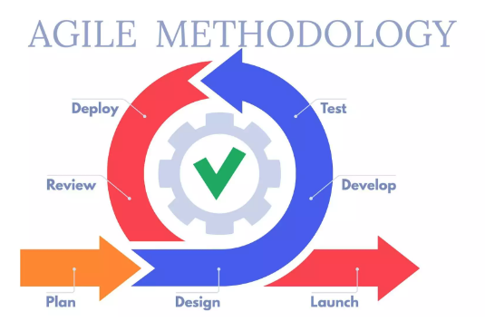

**Framework**

Kanban. Take a task as we need to do it. 
“Kanban is a popular framework used to implement agile and DevOps software development. It requires real-time communication of capacity and full transparency of work. Work items are represented visually on a kanban board, allowing team members to see the state of every piece of work at any time.”

- This is how we set up the initial Trello Board. Wrote all the intial tickets and into a backlog/ to do column that we can all see and track. 

# Brainstorming

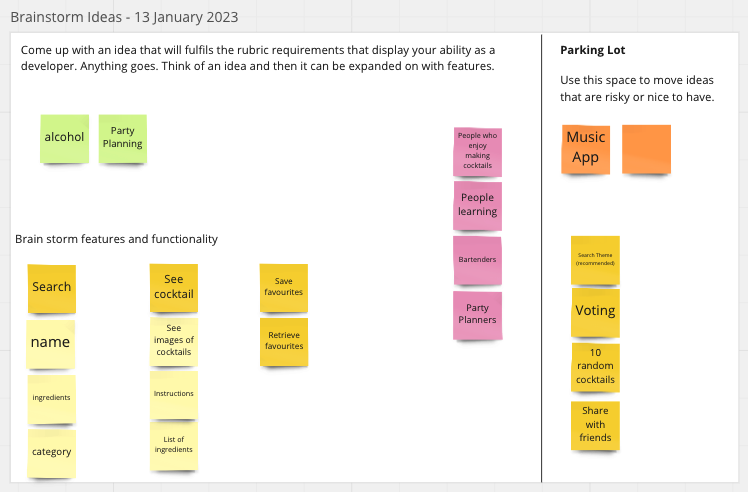

Together we dicussed and used a virtual white board to brainstorm an idea. 

From the original idea, we dicussed features and functionality. We wanted to ensure we had a problem to solve and we did this through further competitor analysis. 

# Defining the problem

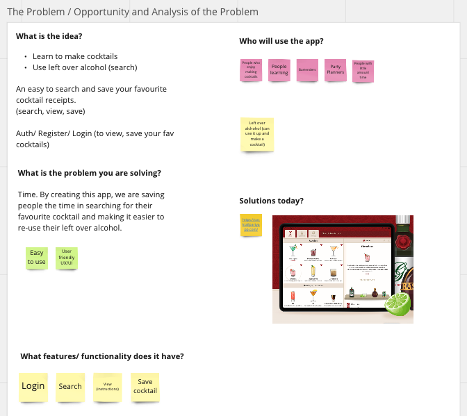

From this acitivity, we knew that we were solving a problem to help customers save time in planning a making and making a delicious cocktail. 

We also knew that we were targeting customers who struggle to find a good cocktail receipe online. This is why we wanted focus on the search functionality as part of the MVP (Minimal Viable Product). 

# User Story Mapping

1. Define a user: We used the name Tom who is planning a party.
2. Follow Tom's journey on how we would use the app.

From the initial story mapping of one user. We realised that the first thing a customer wants to do is Search. This validated our original problem. 

We tested this theory by using competitors online who have a similar application to searching and making cocktails. 

# Analysis

Product analysis is “the process of gathering, defining, and analyzing data about a product or service to make better decisions.” To create products that fit the needs of your target market, you need to have a clear understanding of what those needs are. This is where product analysis comes in.

* Competitor analysis
* UX/UI investigations

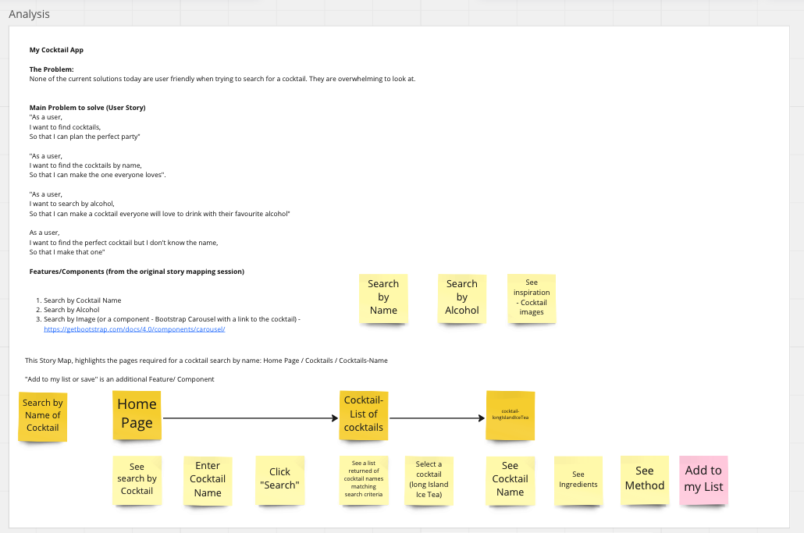

# Design  Concepts

**Attempt 2: Mobile Web Wireframes**

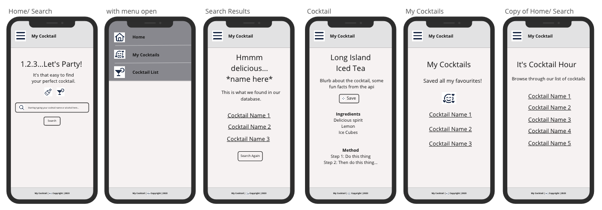

**Attempt 2: Desktop Wireframes**

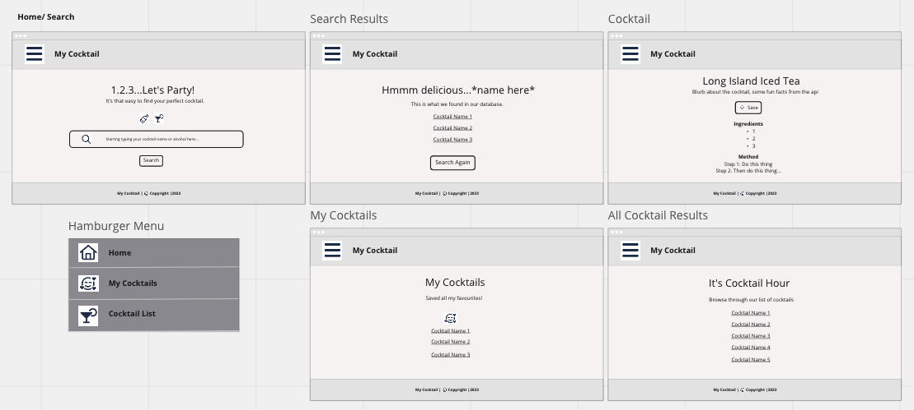

**Design Ideas**

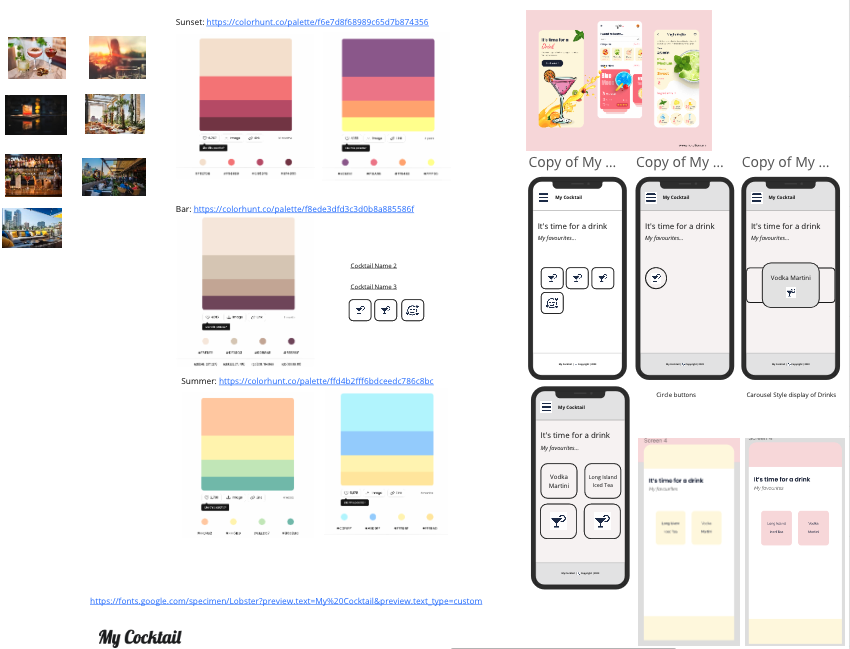

# Technical Documentation

This section is part of the Technical investigations to make sure the product idea is feasabile. While investigating any unknown, spike tickets.

# Cocktail API

Investigation of API's to match our wireframes. 

**API Ninjas**

1. https://api-ninjas.com/api/cocktail

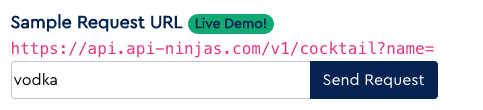

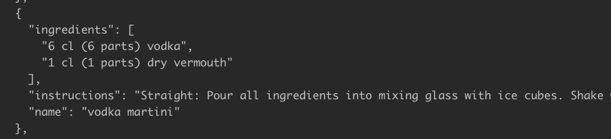

JSON Response
* Ingredients
* Instructions
* Name

**Note**

- API brings back the name of the cocktail.
- API brings back the search results of cocktails if an alcohol is specified.
- API is free to use
- Does not have any other functionality

**The Cocktail DB**

2. https://www.thecocktaildb.com/api.php

**Note**
- API brings back the name of the cocktail.
- API brings back the search results of cocktails if an alcohol is specified.
- API returns images of cocktails
- Test API is free
- However for production it requires a Patreon payment

**Result**

We will be using this API https://www.thecocktaildb.com/api.php 

# Technical Discovery

**Agenda**
- Walk through Wire Frames (updated to include Register/Sign In)
- Discuss Features (Consideration for returning a certain amount of cocktails, rather than an entire list)
- Review Architecture
- Task List (Next Steps for Set Up)
- Discuss Designs (colours/ fonts) 
- Review User Stories

**Notes**
* Updated Miro with notes / Need to add Sign Up / Login / 
* Create Error Page
* Added To-Do List
* Decided on API (Free API | TheCocktailDB.com)

Next Steps: Development set up. 

1. Test Repo (test to Fork, git branch)
2. Follow to do list (set up Frontend/ Backend) - MVC

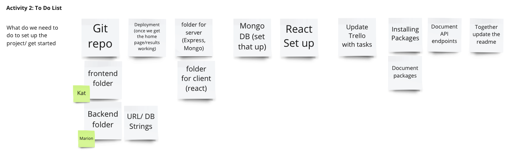

Dataflow structure - Version 1

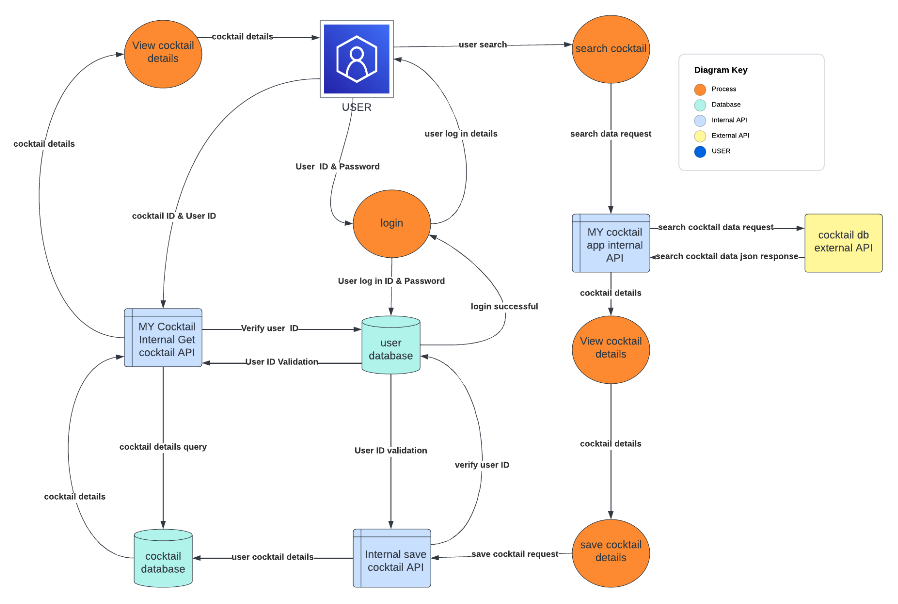

______________________________________________________________

[Return to the Top](#mycocktail)