# MyCocktail-App

**Group Members**

* Marion Akinyi
* Katrina Tomaszczyk

____________________________________________________________________________________

**Important Links**

[Trello](https://trello.com/invite/b/bGaDJxU8/ATTI8ede4dc9eb69ccd7f3c83fc1213fe4b54F7075F6/t3a2-mern-app-part-a) - Product Delivery (Board is Public)

[Miro](https://miro.com/app/board/uXjVPzbXD88=/) - Virtual Whiteboard for Team Collaboration (Anyone with link can view)

[README.md Part-A](/docs/part-a/README.md) - Analysis, Architecture and Design Documentation

____________________________________________________________________________________

## Table of Contents

[Run Scripts](#scripts)

[Packages](#packages)

[Backend](#backend)
- [API Routes](#api)
- [Mongo - Atlas](#mongo)

[Frontend](#frontend)

[Project Delivery](#tracking)

[Unit Testing](#testing)

# Run Scripts

To start the backend and frontend, run the following commands. 

**Folder: MyCocktail-App**

Backend

``npm run backend``

**Note:** Includes nodemon 

Example of Backend Script running:

Frontend

``npm run frontend``

Example of Frontend Script running: 

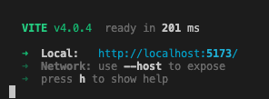

## Packages

**Backend Packages**

* express
* dotenv
* mongoose
* nodemon -D

**Frontend Packages**

* vite
* .dotenv
* react-router-dom
* react-icons
* axios
* toastify
* boostrap

# Backend 

## API Routes

**Function:** Ability to save a cocktail to your list (Favourites). This includes the ability to see all cocktails in the list, add a new cocktail, update an existing cocktail and delete one from the list. (CRUD functionality)

**Route Folder:**  myCocktail_routes.js

**GET** http://localhost:3000/my/cocktail

**POST** http://localhost:3000/my/cocktail

**PUT** http://localhost:3000/my/cocktail/name

**DELETE** http://localhost:3000/my/cocktail/name

## Testing Screenshots of Routes

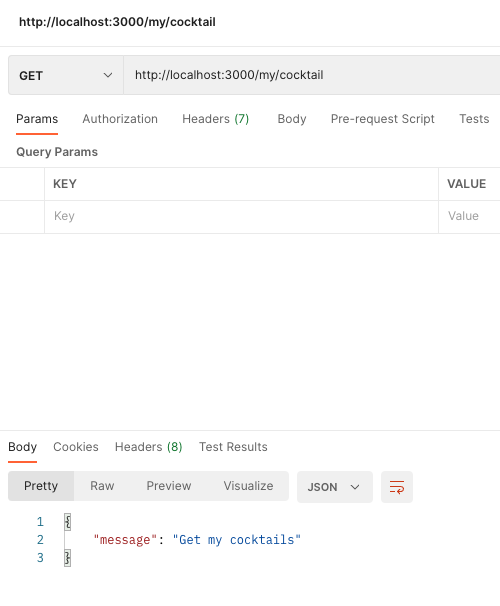
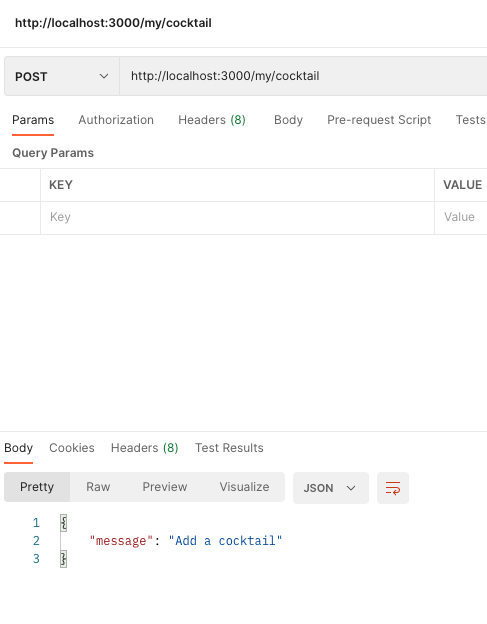
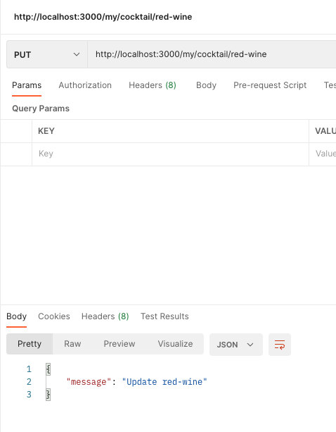
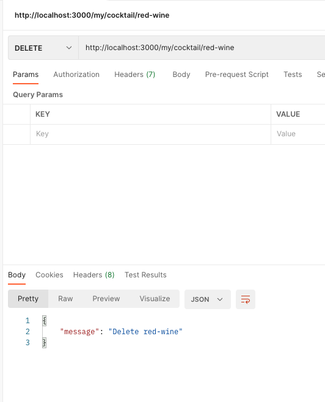

## Mongo Atlas

**Project Name:** MyCocktail-App

**Cluster Name:** MyCocktail-App

**Collections:** 
1. my-cocktails
2. users (tba)

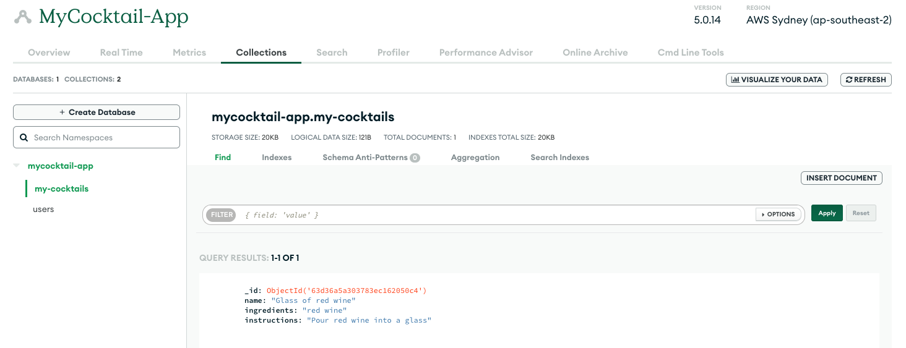

**Post Request**

Successful POST request testing through POSTMAN

____________________________________________________________

# Frontend

# Project Delivery

## Trello Screenshots

**Day 1**

* Start with a Team catch up 
* Create a Repository
* Create folder structures for Backend/Frontend
* Install dependencies

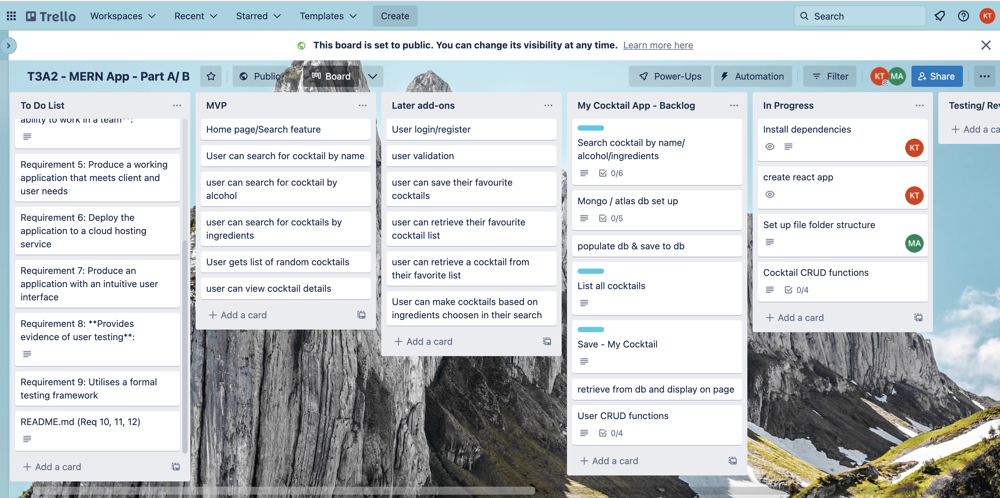

**Day 3** 

* Challenges and steep learning curve to get the React Frontend working
* Success on getting a payload 
* After investigation with better payload data, the api we are using is api ninja
* A few challenges in learning to use git collaborately. Working well now.

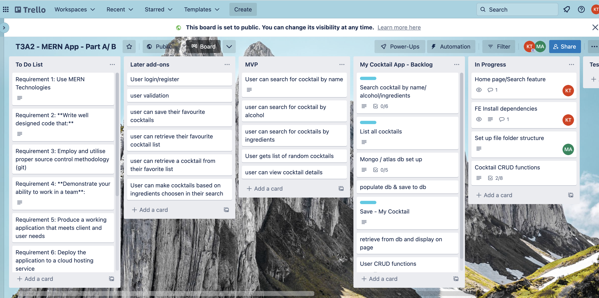

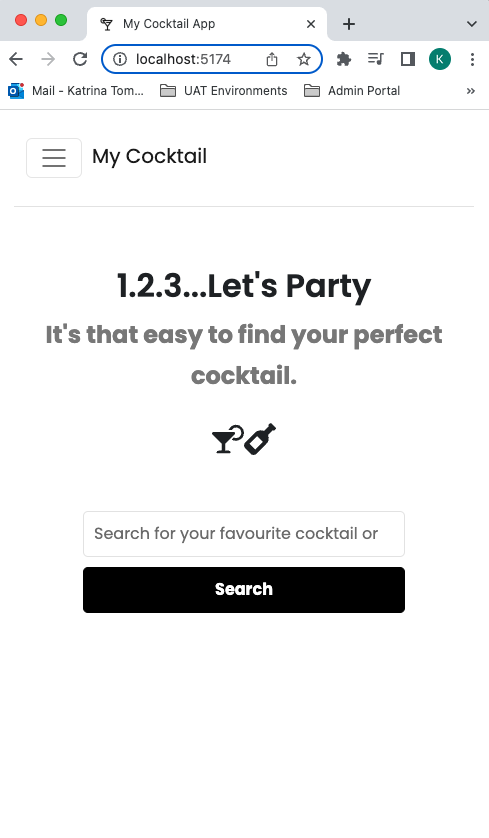 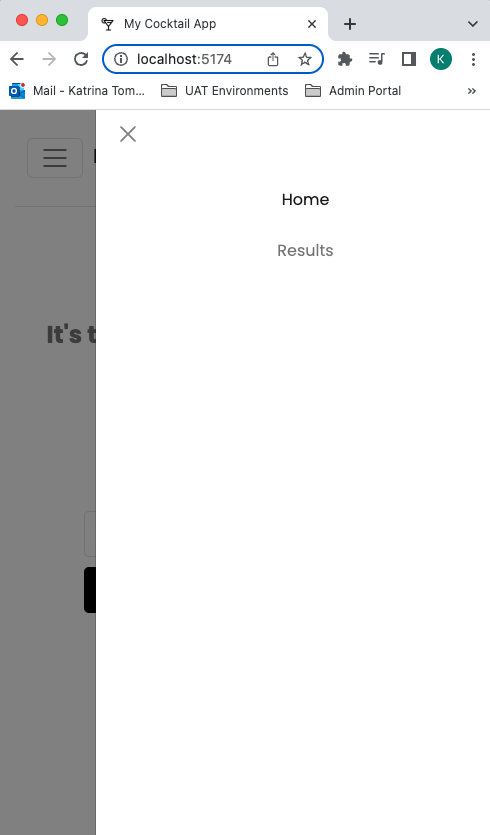

**Day 5**

* Public Holiday on Thursday (Australia Day) 
* Finishing up on Search functionality in React
* Seperated SearchBox as a component 
* Styling updated 

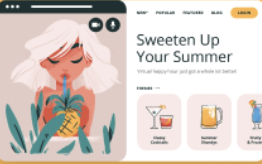

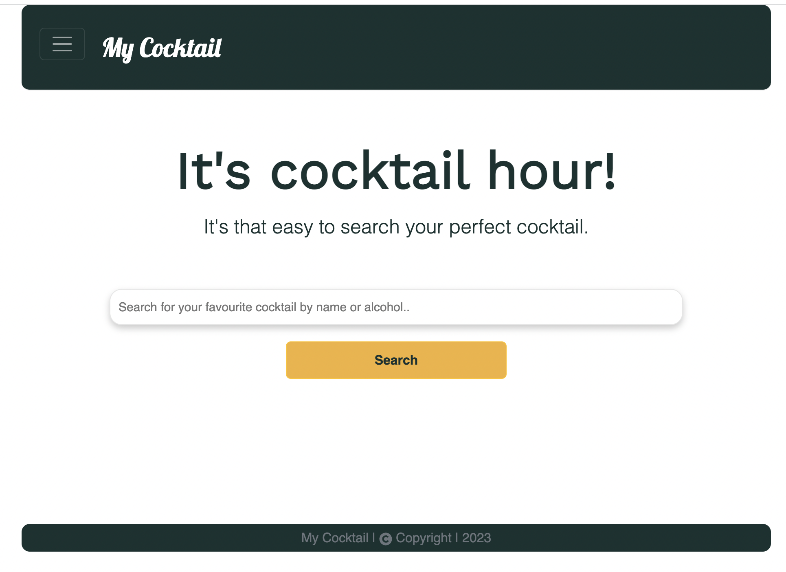

__________________________________________________________________

# Unit Testing

Since the Frontend was built with vite, testing is using vitest. 

**Packages**

* vitest
* jsdom
* @testing-library/react
* @testing-library/react-hooks / --legacy-peer-deps
* @testing-library/user-event
* @testing-library/jest-dom 

Note: Installed as Development dependencies

``npm i -D ...``

**Configuration**

* Add test information to vite.config.js

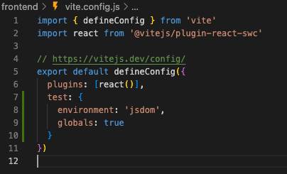

* Updated package.json script

Under scripts

``"test":"vitest"``

* To test run 

``npm text ``

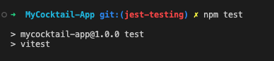

Websites:

* https://vitest.dev/
* https://testing-library.com/docs/react-testing-library/intro/

