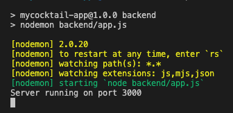
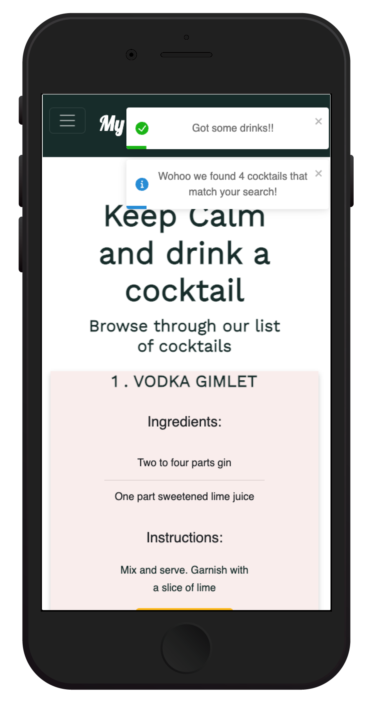

# MyCocktail-App

The purpose of My Cocktail App is to develop a Wiki app guide to making classic and modern cocktails. Using the Api ninjas Cocktail API. It features a database with lists of ingredients for each cocktail recipe, allowing users to quickly find the ingredients they need to craft a particular drink, by filtering using alcohol type, ingredients and name of cocktail.

**Technology Stack: MERN**

* Mongo DB
* Express
* React
* Node JS

____________________________________________________________

**Group Members**

* Marion Akinyi
* Katrina Tomaszczyk

____________________________________________________________

**Important Links**

[Railway Deployment](https://mycocktail.up.railway.app/) - My Cocktail App in Production

[GitHub Repository](https://github.com/marie-debug/MyCocktail-App)

[Trello](https://trello.com/invite/b/bGaDJxU8/ATTI8ede4dc9eb69ccd7f3c83fc1213fe4b54F7075F6/t3a2-mern-app-part-a) - Product Delivery (Board is Public)

[Miro](https://miro.com/app/board/uXjVPzbXD88=/) - Virtual Whiteboard for Team Collaboration (Public Link)

[README.md Part-A](/docs/part-a/README.md) - Analysis, Architecture and Design Documentation

[Testing Documentation](/docs/testing_plan/My%20Cocktail%20App%20-%20Testing.pdf) - Link to spreadsheet
____________________________________________________________

## Table of Contents

[Run Scripts](#scripts)

[Packages](#packages)

[Backend](#backend)
- [External API](#api-ninja)
- [API Routes](#api)
- [Mongo - Atlas](#mongo)

[Frontend](#frontend)
* [Images](#mw)

[Project Delivery](#tracking)
* [Trello](#trello)
* [Source Control](#git)

[Testing](#testing)
* [Testing Plan](#test-plan)
* [Unit Testing](#unit)

[Deployment](#deployment)

# Run Scripts

To start the backend and frontend, run the following commands.

**Folder: MyCocktail-App**

Backend

``npm run backend``

**Note:** Includes nodemon

Example of Backend Script running:

Frontend - React js

``npm run frontend``

Runs the app in development mode

Example of Frontend Script running:

__Dotenv__ 

Two env files are available :
- Include  .env file in the root folder
- Include another .env folder in the frontend folder (So that Vite can access env vars)

____________________________________________________________

## Packages

Run ``npm i`` to install all dependencies

**Backend Packages**

* express
* dotenv
* mongoose
* nodemon -D

**Frontend Packages**

* vite
* .dotenv
* react-router-dom
* react-icons
* react-toastify
* boostrap

**Note:** Testing packages are located under [Unit Testing](#unit)

# Backend 

## External API

External API used: 

**Cocktail API**

The Cocktail API allows you to search thousands of cocktail recipes by name or ingredients.

https://api-ninjas.com/api/cocktail

## API Routes

**Function:**

Ability to save a cocktail to your list (Favourites). This includes the ability to see all cocktails in the list, add a new cocktail from the Cocktail API and delete one from the list.

**Note:** Next iteration includes the ability to add your own cockail (form on the frontend) and update an existing cocktail through the PUT method. The backend was designed with this in mind.

**Route Folder:**  myCocktail_routes.js

**GET** <http://localhost:3000/my/cocktail>

**POST** <http://localhost:3000/my/cocktail>

**DELETE** <http://localhost:3000/my/cocktail/id>

### Testing Screenshots of Routes

____________________________________________________________

## Mongo Atlas

**Project Name:** MyCocktail-App

**Cluster Name:** MyCocktail-App

**Collections:**

1. my-cocktails
2. users (TBA - Next Iteration)

**Post Request**

Successful POST request testing through POSTMAN

# Frontend

## Images

Screenshots of the Mobile Web experience.

**Search/Home**

**Results of Cocktails**

**Results from cocktail search toast**

**Favourites**

**Delete a cocktail from Favourites**

# Project Delivery

Every Monday, Wednesday and Friday a Team catch up:

* Walk the Trello board (discuss in-progress, blocked, finished)
* Discuss any feedback, improve on processes or share any knowledge
* Talk about what is next on the list to do

## Trello Screenshots

**Week 1: Day 1**

* Start with a Team catch up
* Create a Repository
* Create folder structures for Backend/Frontend
* Install dependencies

**Day 3**

* Challenges and steep learning curve to get the React Frontend working
* Success on getting a payload
* After investigation with better payload data, the api we are using is api ninja
* A few challenges in learning to use git collaborately. Working well now.

 

**Day 5**

* Public Holiday on Thursday (Australia Day)
* Finishing up on Search functionality in React
* Seperated SearchBox as a component
* Styling updated

___________________________________________________________

**Week 2 - Day 3**

* successfully deployed the app to Railway! <https://mycocktail.up.railway.app/>
* Review status/ requirements in Trello - update the board
* Review user functionality and set next tasks
* Unit Testing - vitest / jsdom
* Production testing

**Day 5**

* FE and BE unit tests
* Another round of testing in Development and Production
* Add success toast for adding a cocktail to favourites
* Finding other smaller tweaks to improve the user experience
* Add a delete/ remove functionality for Favourites (user can remove a cocktail from their list)

**Submission**

* Development Testing
* Production Testing
* Review of Trello Board
* Review of outstanding tasks
* Review of requirements

____________________________________________________________

## Source Control

* Git repository set up
* Discussions on Merge Requests and Approvers
* Testing before commit
* Testing after commit

[GitHub Repository](https://github.com/marie-debug/MyCocktail-App) - Public Link

# Testing

[Testing Spreadsheet](https://docs.google.com/spreadsheets/d/1U3pMThnGplNzZ5qum9VkcPLLFF5LL1UI-itZlAt9ZiU/edit#gid=609410239) - Public Link

The above attachment includes testing:

* Development throughout the process
* Testing of Production once deployed and after significant changes
* Testing process before commit and after a merge where documented in GIT merge requests with a before/after screenshots or a succint commit message of the changes.

____________________________________________________________

## Unit Testing and Continous Intergration 

The application has been tested in chrome dev tools,

The production and development applications have both gone through extensive automated and manual testing with Postman ,jest-supertest and continous intergration pipeline from git hub to railway.

* jest supertest
  

* Continous Intergration tests pipeline
  

* Railway build logs
  

Websites:

* <https://www.npmjs.com/package/supertest>
* <https://railway.app/>

**Backend Testing**

* To test, run testing script:

``npm run test_express``

# Deployment

Deployment is with Railway.

[Railway Deployment](https://mycocktail.up.railway.app/) - My Cocktail App in Production

___________________________________________________________

[Return to Top](#top)